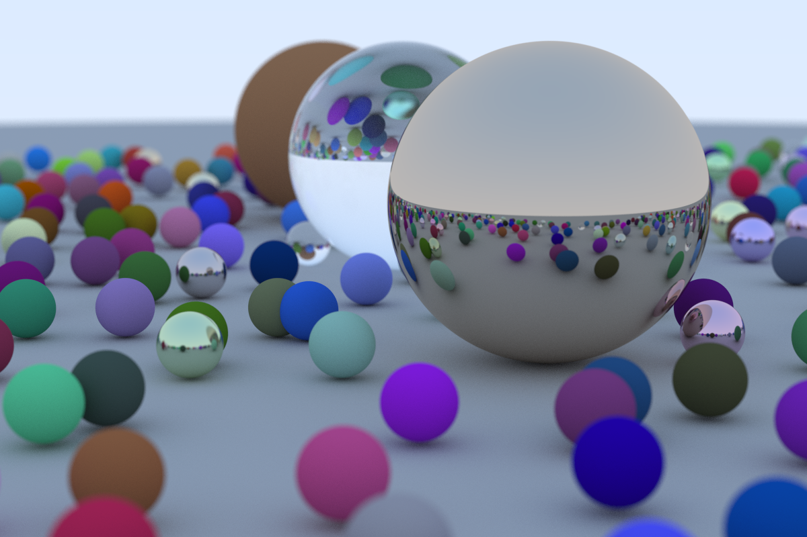

## Ray Tracing in One Weekend
This is an implementation of [Peter Shirley's "Ray Tracing In One Weekend"](https://raytracing.github.io/books/RayTracingInOneWeekend.html) book in Rust after a painful C++ implementation experience.

This is a parallelized implementation, single-threaded implementation is refered to `master` branch.

In this implementation, each material has exclusive sharded mutex rng instead of a global unsafe rng:
```rust
static ref RAND: Arc<Vec<Mutex<StdRng>>> = {
        let mut v = vec![];
        for _ in 0..LEN_OF_RNG {
            v.push(Mutex::new(StdRng::from_rng(thread_rng()).unwrap()));
        }
        Arc::new(v)
    };
```
Besides, each instance has `id` field to map an instance to a mutex to reduce conflict.

`LEN_OF_RNG` can be increased to improve performance if there are too many instances. In this project, each material has only 20 instances, so `LEN_OF_RNG = 5` is a suitable choice.

### Cover
